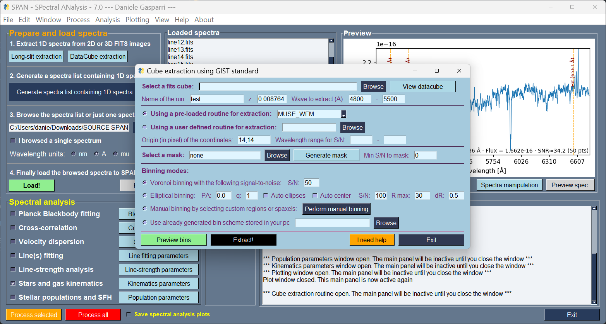

SPAN: SPectral ANalysis software V6.6
Daniele Gasparri, July 2025

# DataCube extraction #

*Datacube extraction parameters*

This module allows you to extract a series of n 1D spectra from a 3D FITS image (i.e., a datacube) following the GIST pipeline standard (Bittner et al., 2019, 2021).

The required parameters are similar to those used in the GIST pipeline (and for any datacube extraction in general).

## Loading and verifying the datacube
The essential files and parameters required for this module to function correctly are highlighted in bold. The first step is to load a fully reduced, valid FITS datacube. Given the lack of a standardised convention for FITS keywords and data storage extensions, it is strongly recommended to use the "View datacube" button to verify that the datacube is correctly read.

This module has been tested with MUSE, CALIFA, JWST NIRSpec IFU, and the new WEAVE LIFU data products. Other formats may only be partially supported. If at least the flux values are properly read, the "View datacube" button should display the image, though the wavelength slider in the Matplotlib window may show only a generic "Wavelength index" instead of actual wavelength values.

Once the datacube is correctly loaded, configure the following basic parameters:

- A run name (arbitrary).
- The source redshift (use zero if no de-redshifting is required).
- The wavelength range for extraction.
- Selecting the extraction routine

In the middle panel, choose the routine for reading and extracting the data. Pre-loaded routines are available for MUSE, CALIFA, WEAVE LIFU, and JWST NIRSpec IFU datacubes. You can write your own extraction routines as .py files following the structure of the available ones and load using the option 'using a user defined routine for extraction'.

Additionally, configure the zero point for spatial coordinates. This is typically the center of the datacube's spatial axes but can also be set to the spaxel coordinates of the galaxy's center. The "View datacube" option is useful for retrieving this information.

## *Applying a spatial mask
Locate the required "Select a FITS mask" field to browse and load a valid mask FITS file. This mask must have the same spatial dimensions as the datacube. If mask is not needed, simply leave this field empty.
If no mask is available but you need it, generate one by clicking "Generate mask". A Matplotlib window will open, displaying the datacube with a slider to navigate across wavelength indices (note: these are indices, not actual wavelengths!). 
To mask specific spaxels (e.g., to exclude sky regions), Ctrl+left-click to mask and Ctrl+right-click to unmask. You can also mask/unmask larger areas by clicking and dragging with the ctrl+left or right mouse button. On touchscreen devices (i.e. Android), masking is performed by tapping and dragging. Unmasking is not yet available. Ensure you remain within the plot boundaries while dragging, or the selection may not be applied.
Once satisfied, close the Matplotlib window. The mask will be automatically saved and loaded in the relative field.
If you open the "Generate mask" window but no masking is needed, simply close the window. An unmasked file will be created automatically but it will not have effect of the DataCube.

## Signal-to-Noise Masking and Binning
Optionally, you can:

- Mask spaxels with low S/N values by specifying a threshold.
- Binning. You have the option to: 1) bin contiguous spaxels using the Voronoi method to achieve the desired S/N; 2) Define n manual bins with mouse multiple selection. The manual bin selection lets you to have the full control on the spaxels to bin. By clicking to the "Manual binning" button, an iterative Matplotlib will appear showing your DataCube. You can select any region to be binned by Ctrl+left-click or dragging on the image. Deselecting can be performed by Ctrl+right-click or dragging. On touchscreen devices (i.e. Android), manual binning regions are selected performed by tapping and dragging. Deselecting is not yet available. Once set your manual regions to be binned, close the matplotlib window; 3) Use pre-existing bin info from a different run. This is useful, for example, if you have a datacube splitted between blue and red arm (e.g. WEAVE LIFU) and you want to sample exactly the same regions. You just need to select the folder where the bin info and masking files are stored from the previous run that you want to take as reference for the binning info. SPAN will find the required files in the folder, copy to the new folder where you are saving the new extracted spectra and rename them according to the folder name. Therefore, the extraction routine will use these bin and mask info instead of generating new ones.

You can always preview the results by clicking on the "Preview bins" button. If Voronoi binning is activated, you will see the Voronoi bins colour coded by their S/N. If Manual binning is activated, you will see the regions you selected that will be binned. In this case you will see still the single spaxels inside these regions, colour coded by their S/N.

## Starting the Extraction
Once all parameters are set, click "Extract!"—and grab a coffee! The extraction process may take several minutes.

Upon completion, both GIST-standard and SPAN-standard spectra will be saved.

**IMPORTANT:** Once the extraction has been performed, any operation of the panel is locked until you will change the "Name of the run", including the preview. If you want to change any parameters and see the result, you MUST first change the "Name of the run". If you try to perform another extraction without changing the "Name of the run", a terminal message will warn that the results in this folder are already available and no extraction is performed.
