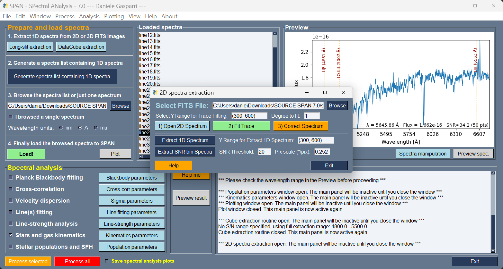

SPAN: SPectral ANalysis Software V6.6
Daniele Gasparri, July 2025

# Long-slit extraction #

*Long-slit extraction parameters*

This module allows you to extract a single 1D spectrum or a series of 1D spectra from a fully reduced 2D FITS image of a long-slit spectrum. The dispersion axis should be aligned with the X-axis, while the spatial axis should be along the Y-axis.

Before proceeding with the extraction, load a valid 2D FITS image and follow these steps:

1. Open the spectrum to verify that the data is correctly formatted and displayed.
2. Fit the trace to identify the maximum photometric values along the dispersion axis. Set the degree of the polynomial curve to be used for fitting the trace and correcting any distortion or tilt in the spectrum.
3. Apply distortion and slope corrections using the trace model obtained in the previous step.
Afterwards, you can choose to:

- Extract and save a single 1D spectrum within a selected Y-range (useful for point sources).
- Extract and save multiple 1D spectra across the entire spatial axis by binning contiguous rows to achieve the desired Signal-to-Noise Ratio (S/N). This option is particularly useful for extended sources (e.g., galaxies), allowing you to sample different regions.
  The S/N threshold you set is an estimate of the actual S/N, based on the sky regions you will select during the extraction routine. Adjust the S/N threshold as needed based on the actual S/N of the bins.
  The pixel scale parameter is optional. If set to zero, it will not be considered.
