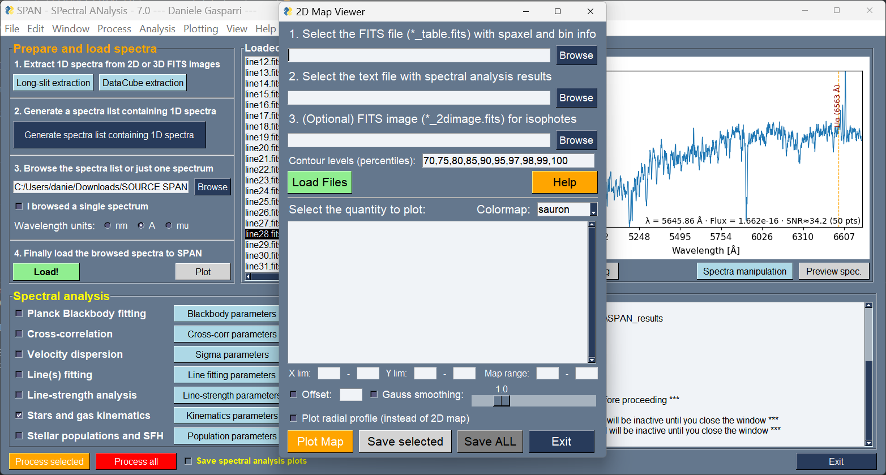

SPAN: SPectral ANalysis software V7.1
Daniele Gasparri, October 2025

# Plot maps window #

*Plot maps window*

This sub-program provides a simple and efficient way to visualize 2D maps from spectra extracted from datacubes and fully processed with SPAN using the "DataCube extraction" sub-program and any Spectral analysis task applied.
You need two mandatory files in order to plot the maps:

1. The RUN_NAME_table.fits generated during the extraction process of the "DataCube extraction" routine, which contains the information of the Voronoi (or manual) spectral bins generated. This file is stored in the "SPAN_results/RUN_NAME" folder, once the datacube extraction is completed.
2. The RUN_NAME_*.dat file(s) generated by any spectral analysis task on the same sample of 1D extracted spectra. This ASCII file is available once a spectral analysis task is performed with the "Process all" mode. 

**Optional file**  
If you want to overplot to the maps also the isophotal contour of your datacube image, you should browse and insert the FITS file containing the image, which has been automatically generated by the "Datacube extraction" sub-program and stored in the "SPAN_results/RUN_NAME" folder. This file has the suffix: "RUN_NAME_2dimage.fits"
If this image is provided, you can play with the contour levels to adjust the isophotal contours to your needs. The contour levels are expressed in percentiles, from 0 to 100, and comma separated. If an invalid value is inserted, the default pre-loaded contours will be used and a message will warn you in the output/terminal window  

**Plotting and saving the maps**  
Once the required files are browsed, just click "Load files" and in the listbox below will appear the quantities available to plot, taken from the ASCII .dat file loaded. You can change the color code of the maps in the "Colormap" menu and then you can plot any of these quantities and display an interactive map on a Matplotlib window by clicking "Plot Map". In this window, you can click on the map to show the identifier of the selected spectral bin and the relative information (e.g. velocity). You can also change the plot and colormap limits.

**Smoothing**  
You can also perform a smoothing of the Voronoi bins (if Voronoi has been performed) and their values to create more pleasant plots. This is achieved by activating the "Gaussian smoothing" option. Adjust the smooth value to your needs and see the results by clicking "Plot map".

**Radial profiles**  
You can alternatively plot the radial profiles of the selected quantity by activating the "Plot radial profile (instead of 2D map)" option. If selected, the isophotes, colormap scheme, limits, and smoothing (if activated) will be ignored and the radial profiles will be plotted instead of the 2D maps.

**Saving the plots**  
Once you are satisfied, you can save the current map in high resolution PNG image by clicking the "Save selected" button, or you can automatically save the maps for all the quantities available by clicking the "Save all" button.

